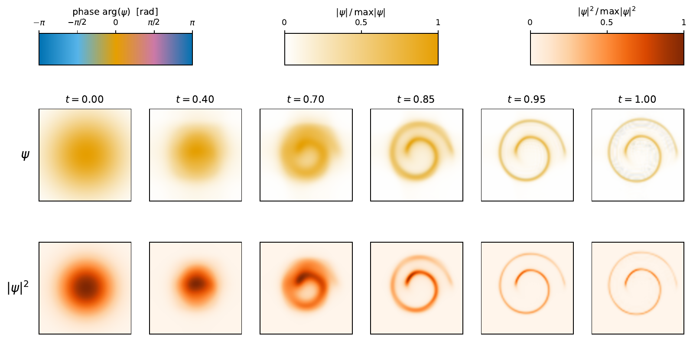

# tnwf — Scalable quantum simulation of continuous-time generative models via tensor networks

Reproduction code for the preprint of the same name.

> 📄 Preprint: _link to appear (arXiv)_
> 🔖 To cite, see [`CITATION.cff`](CITATION.cff).



*Paper Fig. 2 — dense wavefunction evolution (N=64). Top: ψ(t) (hue = arg ψ,
brightness = |ψ|). Bottom: |ψ(t)|². The dynamics under Hᶜ = i[K, Vₜ] transport
the Gaussian source into the target.*

## Overview

We compress the position-diagonal potential (the "V-step") of a wavefunction
flow with tensor network methods, evolving a wavefunction MPS under
`exp(iβ V_t)`:

**JAM** (Joint Action Matching — learns a conservative scalar potential `V_t`)
→ **V-step** methods that apply `exp(iβ V_t)` to the MPS.

### V-step methods

1. **Dense** — exact `O(N^d)` reference
2. **TCI+TDVP1** — TT-cross MPO + 1-site TDVP
3. **TCI+TDVP2** — TT-cross MPO + 2-site TDVP
4. **MPS-V + 2TDVP** — a velocity potential pre-trained as a matrix product state
   (`tnwf.mps_v`) fed straight to the 2-site TDVP V-step, with no runtime tensor
   cross. Train with `python -m tnwf.mps_v.train`; run via
   `run(method="mps_v_tdvp2", ...)`.

## Installation

[uv](https://docs.astral.sh/uv/), Python ≥ 3.11:

```bash
uv sync --extra dev
```

## Quickstart

```bash
uv run pytest -m needle              # < 30s
uv run pytest -m medium              # < 5min, full pipeline

uv run python -m tnwf.jam.train --dataset swiss_roll_2d --seed 0
uv run python scripts/swiss_roll_2d/run_all_methods.py --seeds 0,1,2
uv run python scripts/make_fig2_dense_evolution.py   # → figures/fig2_dense.pdf
```

Datasets are generated on the fly: `swiss_roll_2d` and `gmm_2d … gmm_16d`.

## Demo notebook

[`examples/tnwf_demo.ipynb`](examples/tnwf_demo.ipynb) tours the V-step methods
using the closed-form analytic GMM potential, so it needs no training. It ships
with outputs rendered and is viewable on GitHub without running anything.

- **Part 1** — `Dense` vs `TCI+1TDVP` on a 3-D Gaussian mixture, t-SNE overlay
  against the target (paper **Fig. 5**, left / *d*=3).
- **Part 2** — the **MPS-V + 2TDVP** pipeline at *d*=8, σ=0.5, loading the
  paper's **Table 2** run (N=32, K=160): grid-unbiased sliced Wasserstein
  0.036 ± 0.003 against a sample-size floor of 0.030, self-limiting bond
  χ\* ≈ 16. The shipped `.npz` in
  [`examples/checkpoints/`](examples/checkpoints) holds that run's per-step
  metrics and final-state samples, so nothing reruns for hours. From scratch:
  `scripts/mps_v/generate.py --K 160`.

```bash
make notebook        # or: uv run --with jupyter jupyter notebook examples/tnwf_demo.ipynb
```

Jupyter is pulled in on demand, so it stays out of the locked dependencies.

## Reproducing the paper figures

Each generator writes to a relative `figures/` path (override with `--out`). The
manuscript has 8 figures + 2 tables and the supplement 5 + 2; the tables below
are exhaustive, so what is and is not released is unambiguous.

### Main text

| Float | Asset | Generator | Status |
|---|---|---|---|
| Fig 1 | `fig1_overview_tikz.pdf` | — | TikZ, built in the LaTeX source |
| Fig 2 | `fig2_dense.pdf` | `make_fig2_dense_evolution.py` | ✅ needs `jam/seed0.pt` |
| Fig 3 | `fig_gmm_ode.pdf` | `make_fig_gmm_ode.py` | ✅ self-contained |
| Fig 4 | `fig_scaling_bounds.pdf` | `make_fig_scaling_bounds.py` | ✅ needs `scaling_theory` CSVs |
| Fig 5 | `fig_tsne_grid.pdf` | `make_fig_tsne_grid.py` | ✅ needs sweeps |
| Table 1 | `table1_sw.tex` | `make_table1_sw.py` | ✅ needs sweeps |
| Fig 6 | `fig_cost_scaling.pdf` | `make_fig_cost_scaling.py` | ✅ needs sweeps |
| Fig 7 | `fig_ksweep_trained_std0.5_noHyb_wt.pdf` | *not released* | cloud (Modal) timing driver |
| Table 2 | `table_scaling.tex` | `make_table2_scaling.py` | ✅ needs `timing_scaling` + MPS-V checkpoints |
| Fig 8 | `fig_rare_event_advantage.pdf` | `make_fig_rare_event.py` | ✅ needs MPS-V checkpoints |

### Supplement

| Float | Asset | Generator | Status |
|---|---|---|---|
| Table S1 | — | — | hand-written tabular in the LaTeX source |
| Fig S1 | `figS1_supp_pareto.pdf` | `make_fig_supp_pareto.py` | ✅ needs sweeps |
| Table S2 | `table_core4_audit.tex` | *not released* | cloud (Modal) audit driver |
| Fig S2 | `fig_panelA_sigma.pdf` | *not released* | intermediate run outputs not preserved |
| Fig S3 | `fig_panelN_resolution.pdf` | *not released* | intermediate run outputs not preserved |
| Fig S4 | `fig_panelD_ksigma.pdf` | *not released* | cloud (Modal) timing driver |
| Fig S5 | `fig_analytic_vs_trained_std0.5_wt.pdf` | *not released* | intermediate run outputs not preserved |

**Fig 2–6, Fig 8, Tables 1–2 and Fig S1 reproduce exactly** — byte- or
content-identical to the manuscript. Fig 1 and Table S1 are built by LaTeX. The
rest (Fig 7, Table S2, Fig S2–S5 — 6 assets) come from cloud drivers or from
intermediate outputs that were not preserved.

Fig 4 ships only the *plotting* half of the analytic scaling study: the
`data/scaling_theory/` cache is in the archive below, but the compute pass that
produces it depends on unreleased solver code. The figure reproduces exactly
from that cache; its numbers are not re-derived.

## Getting the data archive

Floats marked "needs …" read from `data/`, which is **not in this repository** —
41 MB unpacked, almost all hyperparameter sweeps. It is deposited with
**restricted** access: the DOI and its metadata are public and citable, but the
files are released on request (see [`zenodo.json`](zenodo.json)).

DOI: [10.5281/zenodo.21845216](https://doi.org/10.5281/zenodo.21845216)

```bash
cd tnwf-paper
curl -L -o tnwf-paper-data.tar.gz "https://zenodo.org/records/21845216/files/tnwf-paper-data.tar.gz"

# Verify before unpacking. The build is byte-reproducible, so rebuilding from
# the same inputs reproduces this digest exactly.
echo "a6507894a3334221c05d3f9a08c83630f16ccc91837ed607770868e1511a19cf  tnwf-paper-data.tar.gz" | shasum -a 256 -c

# Unpack AT THE REPO ROOT — every member is rooted at data/, and several
# generators hardcode relative paths like data/gmm_2d_hp/ with no CLI override.
tar xzf tnwf-paper-data.tar.gz

make verify-data          # every file against the archive's own MANIFEST.tsv
```

That creates:

```
data/
├── gmm_2d_hp/  gmm_3d_hp_v2/  gmm_4d_hp/ … gmm_8d_hp/   sweeps  → Fig 5, 6, S1, Table 1
├── scaling_theory/                                      CSVs    → Fig 4
├── timing_scaling/  mps_v_checkpoints/                          → Table 2
└── {swiss_roll_2d,gmm_2d,gmm_3d}/jam/                   JAM ckpts → Fig 2
```

`MANIFEST.tsv` travels inside the archive, so `make verify-data` establishes
internal consistency, not provenance — for provenance use the tarball checksum
above. `data/exact_sw_floor.json` (Table 1's target–target row) is small enough
to live in this repository and is already present.

With the archive unpacked:

```bash
make fig2 fig-scaling-bounds fig-tsne fig-cost-scaling supp table1 table2
make fig-rare-event                                    # needs MPS-V checkpoints
uv run python scripts/make_fig_gmm_ode.py              # needs no archive data
```

### Notes on the reproducible floats

**Fig 2 needs the trained JAM checkpoint, not merely retraining.** `make
jam-swiss` trains one, but training is stochastic, so a retrained `V_t` gives a
slightly different figure — 517468 bytes retrained versus 517509 with the
original. The originals are in the archive at
`data/{swiss_roll_2d,gmm_2d,gmm_3d}/jam/`.

**Fig 8 needs the MPS-V checkpoint.** Its wavefunction flow pipeline reads
`examples/rare_event/rep*.npz` — the final MPS cores from the ten Table 2
replicates (N=32, K=160, D_max=64), converted from the original pickles so this
repository ships no `pickle` payloads. The flow ODE pipeline integrates `grad V`
of the *same* learned potential, which lives in `data/mps_v_checkpoints/`. Using
one potential for both pipelines is what makes the comparison fair: the learning
error is then common to the two, so the figure contrasts the transports and
sampling methods rather than two different velocity fields. `make
fig-rare-event` fails with a pointer to the archive if the checkpoint is absent.
It writes the manuscript's filename directly and defaults to the paper's
`--tail-k 4.0`, so a bare run reproduces the figure; ~1 min at 40,000 samples
per pipeline.

**Fig 5 palette.** The color stops in `make_fig_tsne_grid.py` are pinned as
explicit magma triples (LUT indices 38 / 128 / 199) rather than
`plt.cm.magma(f)` calls. magma is a 256-entry lookup table, so `magma(f)` is
piecewise constant in `f` and an approximate `f` lands on a neighboring stop.
Leave them pinned.

## Layout

```
tnwf/
├── src/tnwf/             # package: jam/, mps_v/, mps/, mpo/, dense/, metrics/, data/, pipelines/, amp.py
├── tests/                # pytest suite mirroring src/tnwf/
├── scripts/make_*.py     # one generator per paper float
├── scripts/{dataset}/    # per-dataset runners (train_jam, run_all_methods)
├── examples/rare_event/  # Fig 8's MPS cores (the only bulk data tracked here)
├── pyproject.toml        # package + dependency declarations
└── uv.lock               # fully pinned dependency lock
```

Everything under `scripts/` either generates a manuscript float or produces the
sweep data one consumes. `figures/`, `results/` and the bulk of `data/` are
generated or downloaded, and are not version-controlled.

## Dependencies & licenses

Dependencies are pinned in [`uv.lock`](uv.lock). The license of every one of the
30 third-party packages is reproduced in full under [`licenses/`](licenses/),
indexed by
[`licenses/THIRD_PARTY_NOTICES.md`](licenses/THIRD_PARTY_NOTICES.md).

Every package's own code is permissively licensed (MIT, BSD, Apache-2.0, PSF).
Two components are not, and are disclosed in the notices: `scipy`'s wheel ships
`libgfortran` and `libgcc_s` (GPL-3.0-or-later **with** the GCC Runtime Library
Exception, which exists to permit linking into non-GPL software) and
`libquadmath` (LGPL-2.1-or-later, satisfied by dynamic linking against an
unmodified library plus notice). This repository vendors no third-party source
code; `licenses/` holds license texts only.

## License

MIT — see [`LICENSE`](LICENSE). Third-party terms are in
[`licenses/`](licenses/).
